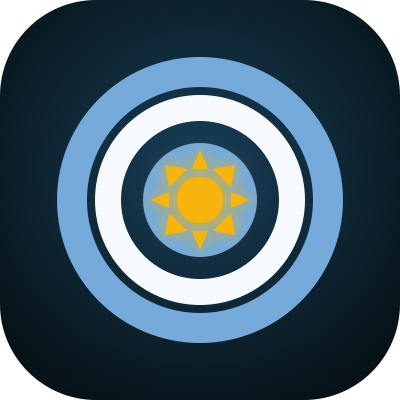

<p align="center">
  
</p>

<h1 align="center">Codex Dream Skin Studio</h1>

<p align="center">
  A safe, reversible macOS Skill for turning personal images into live Codex Desktop themes.
</p>

<p align="center">
  <a href="#english">English</a> ·
  <a href="#español">Español</a> ·
  <a href="#中文">中文</a>
</p>

> [!IMPORTANT]
> Codex Dream Skin Studio is an unofficial community project. It is not affiliated with or endorsed by OpenAI. It does not edit the official Codex application bundle, its code signature, or `app.asar`.

## Language support

| Item | Available languages |
| --- | --- |
| README instructions | English, Español, 中文 |
| Generated theme interface | English (`--language en`), Español (`--language es`) |
| Skill commands and diagnostics | English |
| Themed browser profile | Isolated under `~/Library/Application Support/CodexDreamSkinStudio/profile` |

---

## English

### Features

- Use a personal image as the Codex home banner and full-task background.
- Apply the bundled Argentina / Lionel Messi or Spain / Lamine Yamal preset.
- Keep the native sidebar, task content, Outputs panel, menus, and composer interactive.
- Correct portrait cropping, blurry source images, and off-center card icons.
- Verify the live interface and restore the official appearance safely.

### Requirements

- macOS.
- The official signed Codex Desktop application.
- Codex has been opened at least once.
- No global Node.js or npm installation is required.
- The themed session uses a separate local Chromium profile; it never copies or modifies the default Codex profile.

### 1. Install the Skill

Download and extract the latest package from:

[Download the latest release](https://github.com/Lxcalibur/codex-dream-skin-studio/releases/latest)

Move the extracted folder to:

```text
~/.codex/skills/codex-dream-skin-studio
```

Or clone the repository:

```bash
git clone https://github.com/Lxcalibur/codex-dream-skin-studio.git \
  "$HOME/.codex/skills/codex-dream-skin-studio"
```

### 2. Ask Codex to apply a theme

Start a new Codex task and enter:

```text
Use $codex-dream-skin-studio to install and verify the Argentina theme in English.
```

For a personal photo:

```text
Use $codex-dream-skin-studio to turn my attached photo into a portrait Codex theme in English and verify both the home and task screens.
```

### 3. Manual workflow

```bash
SKILL_DIR="$HOME/.codex/skills/codex-dream-skin-studio"

"$SKILL_DIR/scripts/dream-skin.sh" test
"$SKILL_DIR/scripts/dream-skin.sh" install --no-launch
"$SKILL_DIR/scripts/dream-skin.sh" preset argentina \
  --language en \
  --no-apply
"$SKILL_DIR/scripts/dream-skin.sh" start
"$SKILL_DIR/scripts/dream-skin.sh" verify \
  --screenshot "/tmp/codex-dream-skin-home.png"
"$SKILL_DIR/scripts/dream-skin.sh" doctor --require-live
```

If Codex is already running without the verified theme endpoint, applying the theme requires a restart. Use `start --restart-existing` only after approving that restart.

### 4. Use a personal image

```bash
"$SKILL_DIR/scripts/dream-skin.sh" customize \
  --image "/absolute/path/to/photo.jpg" \
  --name "My Codex Theme" \
  --layout portrait \
  --position "right center" \
  --scale "100%" \
  --language en \
  --no-apply
```

- Use `portrait` for a standing player or person.
- Use `cover` for a landscape image.
- Start portrait images at `100%` scale.
- Prefer a source image with a 2400–3200 px long edge.

### 5. Restore

Remove the live theme:

```bash
"$SKILL_DIR/scripts/dream-skin.sh" restore
```

Restore the saved Codex base theme and restart Codex:

```bash
"$SKILL_DIR/scripts/dream-skin.sh" restore \
  --restore-base-theme \
  --restart-codex
```

---

## Español

### Funciones

- Usa una imagen personal como banner de inicio y fondo completo de las tareas de Codex.
- Aplica los temas incluidos de Argentina / Lionel Messi o España / Lamine Yamal.
- Mantiene interactivos la barra lateral, las tareas, el panel Outputs, los menús y el compositor.
- Corrige recortes de retratos, imágenes de baja resolución e iconos descentrados.
- Verifica la interfaz en vivo y restaura de forma segura la apariencia oficial.

### Requisitos

- macOS.
- La aplicación oficial y firmada de Codex Desktop.
- Haber abierto Codex al menos una vez.
- No es necesario instalar Node.js ni npm globalmente.
- La sesión con tema usa un perfil local aislado de Chromium; no copia ni modifica el perfil predeterminado de Codex.

### 1. Instalar el Skill

Descarga y descomprime la versión más reciente:

[Descargar la última versión](https://github.com/Lxcalibur/codex-dream-skin-studio/releases/latest)

Mueve la carpeta extraída a:

```text
~/.codex/skills/codex-dream-skin-studio
```

También puedes clonar el repositorio:

```bash
git clone https://github.com/Lxcalibur/codex-dream-skin-studio.git \
  "$HOME/.codex/skills/codex-dream-skin-studio"
```

### 2. Pedirle a Codex que aplique un tema

Abre una nueva tarea de Codex y escribe:

```text
Usa $codex-dream-skin-studio para instalar y verificar el tema de Argentina en español.
```

Para una foto personal:

```text
Usa $codex-dream-skin-studio para convertir mi foto adjunta en un tema vertical de Codex en español y verifica las pantallas de inicio y de tarea.
```

### 3. Flujo manual

```bash
SKILL_DIR="$HOME/.codex/skills/codex-dream-skin-studio"

"$SKILL_DIR/scripts/dream-skin.sh" test
"$SKILL_DIR/scripts/dream-skin.sh" install --no-launch
"$SKILL_DIR/scripts/dream-skin.sh" preset argentina \
  --language es \
  --no-apply
"$SKILL_DIR/scripts/dream-skin.sh" start
"$SKILL_DIR/scripts/dream-skin.sh" verify \
  --screenshot "/tmp/codex-dream-skin-home.png"
"$SKILL_DIR/scripts/dream-skin.sh" doctor --require-live
```

Si Codex ya está abierto sin el punto de conexión verificado del tema, es necesario reiniciarlo. Usa `start --restart-existing` solamente después de autorizar el reinicio.

### 4. Usar una imagen personal

```bash
"$SKILL_DIR/scripts/dream-skin.sh" customize \
  --image "/ruta/absoluta/a/foto.jpg" \
  --name "Mi tema de Codex" \
  --layout portrait \
  --position "right center" \
  --scale "100%" \
  --language es \
  --no-apply
```

- Usa `portrait` para una persona o un jugador de pie.
- Usa `cover` para una imagen horizontal.
- Empieza los retratos con una escala de `100%`.
- Se recomienda una imagen con un lado largo de 2400–3200 px.

### 5. Restaurar

Quita el tema activo:

```bash
"$SKILL_DIR/scripts/dream-skin.sh" restore
```

Restaura el tema base guardado y reinicia Codex:

```bash
"$SKILL_DIR/scripts/dream-skin.sh" restore \
  --restore-base-theme \
  --restart-codex
```

---

## 中文

### 功能

- 把个人照片设置为 Codex 首页横幅和完整任务背景。
- 使用内置的阿根廷 / 梅西或西班牙 / 亚马尔世界杯主题。
- 保留原生侧边栏、任务内容、Outputs 面板、菜单和输入框交互。
- 优化竖版人物裁切、低清晰度照片和卡片图标偏移问题。
- 实机验证主题效果，并可安全恢复官方界面。

### 系统要求

- macOS。
- 官方签名的 Codex Desktop 应用。
- 至少启动过一次 Codex。
- 不需要全局安装 Node.js 或 npm。
- 主题会话使用独立的本地 Chromium 资料目录，不会复制或修改默认 Codex 资料。

### 1. 安装 Skill

下载并解压最新版本：

[下载最新 Release](https://github.com/Lxcalibur/codex-dream-skin-studio/releases/latest)

把解压后的文件夹放到：

```text
~/.codex/skills/codex-dream-skin-studio
```

也可以克隆 GitHub 仓库：

```bash
git clone https://github.com/Lxcalibur/codex-dream-skin-studio.git \
  "$HOME/.codex/skills/codex-dream-skin-studio"
```

### 2. 让 Codex 自动应用主题

新建一个 Codex 任务，然后输入：

```text
使用 $codex-dream-skin-studio 安装并验证英文版阿根廷主题。
```

使用个人照片时输入：

```text
使用 $codex-dream-skin-studio 把我附加的照片制作成英文竖版 Codex 主题，并验证首页和任务页面。
```

### 3. 手动操作

```bash
SKILL_DIR="$HOME/.codex/skills/codex-dream-skin-studio"

"$SKILL_DIR/scripts/dream-skin.sh" test
"$SKILL_DIR/scripts/dream-skin.sh" install --no-launch
"$SKILL_DIR/scripts/dream-skin.sh" preset argentina \
  --language en \
  --no-apply
"$SKILL_DIR/scripts/dream-skin.sh" start
"$SKILL_DIR/scripts/dream-skin.sh" verify \
  --screenshot "/tmp/codex-dream-skin-home.png"
"$SKILL_DIR/scripts/dream-skin.sh" doctor --require-live
```

如果 Codex 已经运行，但没有经过验证的主题端点，应用主题时需要重启。只有在确认允许重启后，才使用 `start --restart-existing`。

### 4. 使用个人照片

```bash
"$SKILL_DIR/scripts/dream-skin.sh" customize \
  --image "/照片的绝对路径/photo.jpg" \
  --name "我的 Codex 主题" \
  --layout portrait \
  --position "right center" \
  --scale "100%" \
  --language en \
  --no-apply
```

- 站立人物或球员照片使用 `portrait`。
- 横向照片使用 `cover`。
- 竖版照片建议从 `100%` 缩放开始。
- 推荐使用长边 2400–3200 px 的原图。

主题界面目前支持英文（`--language en`）和西班牙语（`--language es`）；本章节提供中文使用说明。

### 5. 恢复

移除当前主题：

```bash
"$SKILL_DIR/scripts/dream-skin.sh" restore
```

恢复保存的 Codex 基础主题并重启：

```bash
"$SKILL_DIR/scripts/dream-skin.sh" restore \
  --restore-base-theme \
  --restart-codex
```

---

## Safety and licensing

- CDP is bound to loopback and accepted only when the endpoint belongs to the verified Codex process.
- The official Codex application bundle, code signature, and `app.asar` remain unchanged.
- Chromium remote debugging uses a dedicated non-default profile; the default Codex profile is never copied, moved, or symlinked.
- Software source code is licensed under the [MIT License](LICENSE).
- Bundled photograph sources, authors, modifications, and Creative Commons terms are recorded in [ATTRIBUTION.md](assets/engine/assets/world-cup/ATTRIBUTION.md).
- No endorsement by OpenAI, the photographers, the players, their teams, Wikimedia Commons, or tournament organizers is implied.
